# AD-Splunk-Detection-Lab

## 🛡️ Active Directory Attack Detection Lab using Splunk, Hydra & Atomic Red Team 

A hands-on SOC-style lab: build an AD domain, forward Sysmon & Windows event logs to Splunk, simulate attacks (Hydra brute force + Atomic Red Team), and detect the activity using Splunk queries.

---

## TL;DR
Built a three-tier home lab (Domain Controller, Windows endpoint, Splunk server) plus an attacker VM. Installed Sysmon on endpoints and Splunk Universal Forwarders to ship logs to Splunk Enterprise (Ubuntu). Simulated a Hydra brute force and Atomic Red Team tests to generate telemetry and validated detections in Splunk.

---

## Project Overview
- Set up Active Directory (Windows Server 2022) and join a Windows 11 endpoint to the domain.  
- Install Sysmon + Splunk Universal Forwarder on endpoints for log ingestion.  
- Set up a Splunk Server on Ubuntu for centralized log analysis and create an index (`endpoint`).  
- Simulate attacks:
  - Hydra brute force from Kali Linux
  - Atomic Red Team tests (local user creation, PowerShell bypass) on the Windows endpoint  
- Detect attacks in Splunk using Windows Event Logs and Sysmon telemetry.
  
**The goal was to gain hands-on experience in:**

- Active Directory basics
- Log forwarding pipeline
- Detecting brute force activity
- Detecting suspicious account creation
- Detecting PowerShell execution techniques
- Understanding how telemetry flows from endpoint → forwarder → Splunk index

---

## Lab Architecture
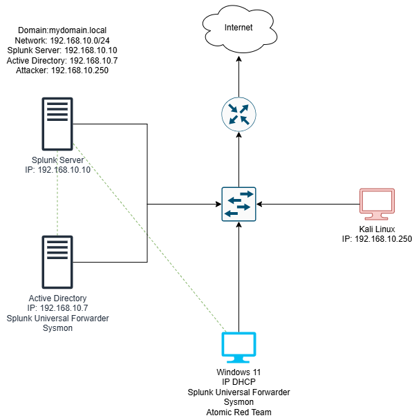  
<p align="center"><em>*Figure: Lab Architecture Diagram.*</em></p>

**Network:** VirtualBox NAT Network (subnet `192.168.10.0/24`)

| Device | OS | Role | IP |
|--------|----|------|----:|
| Windows Server 2022 | Domain Controller (AD DS + DNS) | DC | `192.168.10.7` |
| Windows 11 | Victim endpoint | Sysmon + ATR | `192.168.10.100` |
| Ubuntu Server | Splunk Enterprise (Indexer + Web UI) | Receives logs on 9997 | `192.168.10.10` |
| Kali Linux | Attacker | Hydra brute force | `192.168.10.250` |

**Diagram:**  
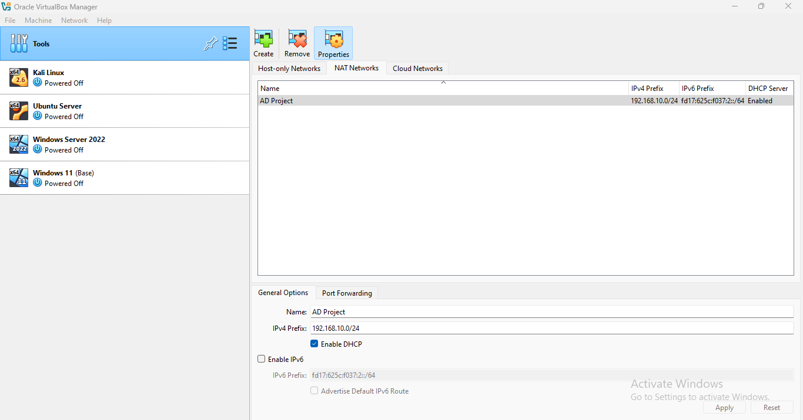  
<p align="center"><em>*Figure: Logical lab layout and IP assignments.*</em></p>

---

## Environment Setup

### Windows Server 2022 — Domain Controller
- Installed **Active Directory Domain Services** and promoted to DC.  
- Domain: **`mydomain.local`**  
- Static IP: `192.168.10.7`  
- Created OUs and users:
  - OU: `HR` — user **Terry Smith**  
  - OU: `IT` — user **Jenny Smith**

**Screenshot:**  
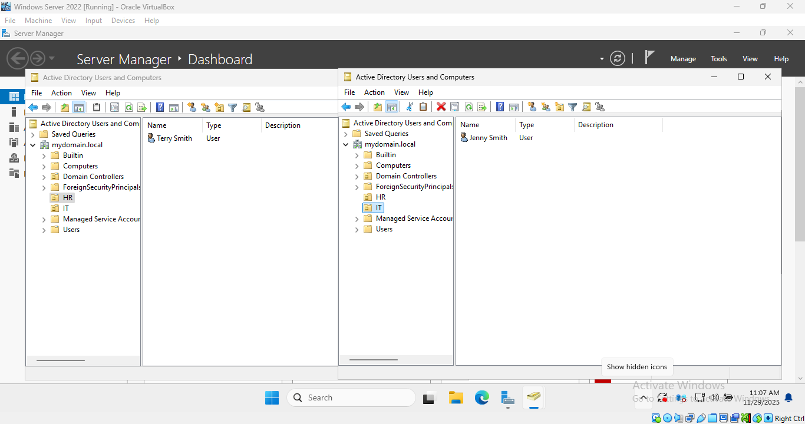  
<p align="center"><em>*Figure: Active Directory users and OUs.*</em></p>

---

### Windows 11 — Victim
- Static IP: `192.168.10.100`  
- DNS: `192.168.10.7` (domain controller)  
- Joined to domain and logged in as **Jenny Smith**  
- Installed:
  - **Sysmon** (with Olafhartong config)  
  - **Splunk Universal Forwarder**  
- Configured forwarder to send logs to `192.168.10.10:9997` and index them to `endpoint`.

**Screenshot:**  
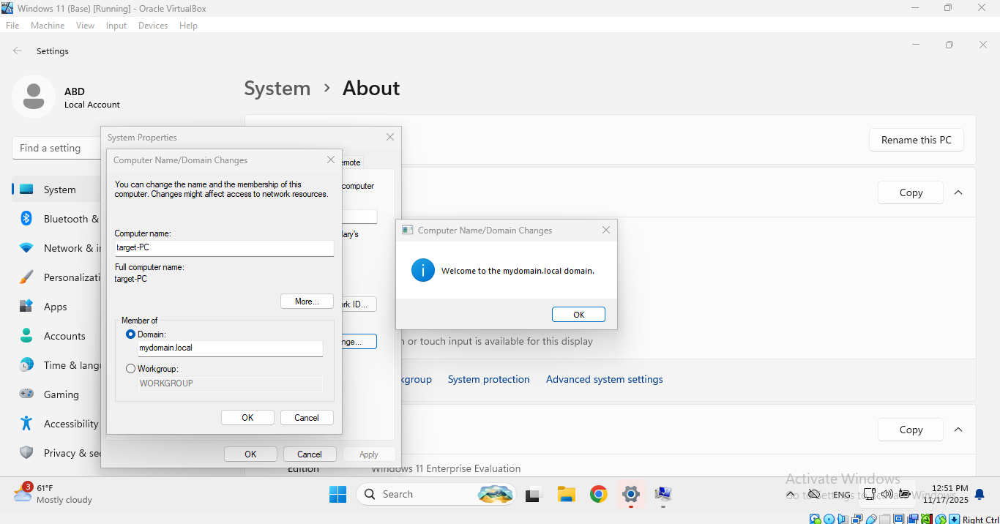  
<p align="center"><em>*Figure: Windows 11 joined to mydomain.local.*</em></p>

---

### Ubuntu Server — Splunk Enterprise
- Static IP: `192.168.10.10`  
- Installed Splunk Enterprise (web UI on port `8000`)  
- Created index: `endpoint`  
- Enabled receiving on port `9997` (for forwarders)

**Screenshot:**  
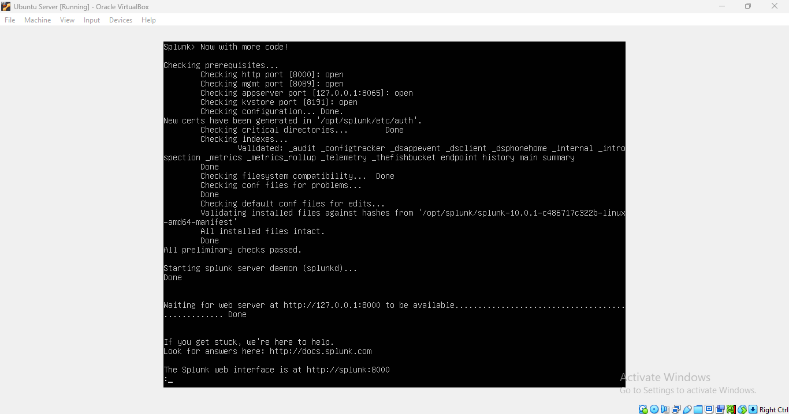  
<p align="center"><em>*Figure: Splunk Enterprise running on Ubuntu.*</em></p>

---

### Kali Linux — Attacker
- Static IP: `192.168.10.250`  
- Used Hydra for brute force attacks against the Windows 11 victim.

**Screenshot:**  
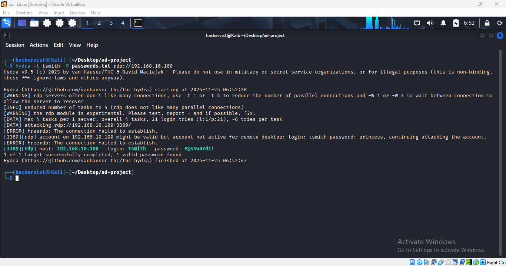  
<p align="center"><em>*Figure: Hydra brute force running on Kali.*</em></p>

---

## Attack Simulations

### 1) Hydra brute force (Credential Access)
- Targeted the Windows 11 RDP/login (simulate repeated login attempts).  
- Produced many failed authentication events (Event ID `4625`) and eventually a successful login (Event ID `4624`) when a correct password was present in the wordlist.

**Screenshot:**  
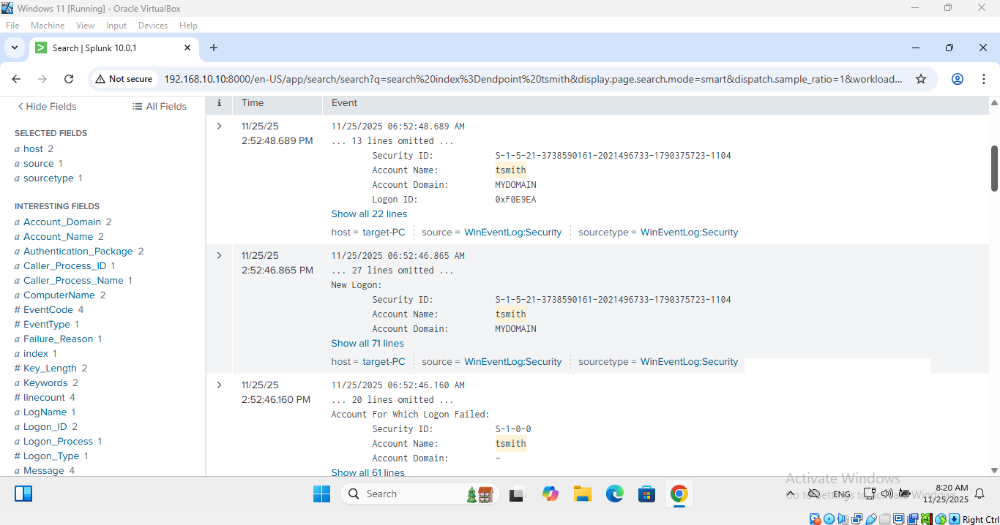  
<p align="center"><em>*Figure: Multiple `4625` events showing failed login attempts.*</em></p>

---

### 2) Atomic Red Team (Execution & Persistence)
- **Test A — Local user creation** (Persistence / T1136)  
  - Atomic Red Team test created a new local user on the Windows endpoint.  
  - Expected event: `4720` (user account created).

- **Test B — PowerShell bypass** (Execution, T1059.001)  
  - Executed PowerShell with `-ExecutionPolicy Bypass -NoProfile` to simulate script execution/evasion.  
  - Sysmon captured process creation with the `CommandLine` arguments.

**Screenshot:**  
  
<p align="center"><em>*Figure: Event showing new local user creation (Event ID 4720).*</em></p>

**Screenshot:**  
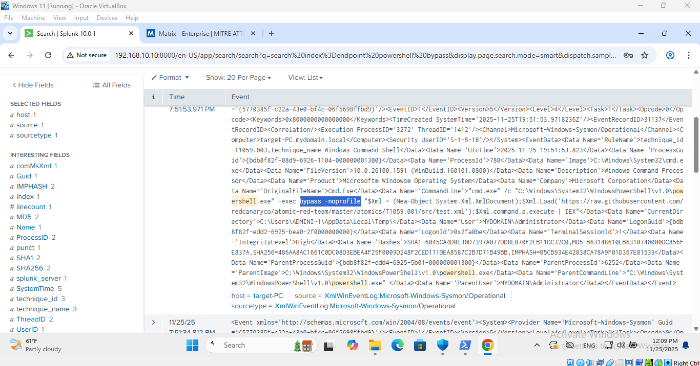  
<p align="center"><em>*Figure: Sysmon process creation showing PowerShell with bypass flags.*</em></p>

---

## Splunk Ingestion & Configuration Notes
- Forwarders were configured to send Windows Event Logs and Sysmon events to Splunk on `192.168.10.10:9997`.  
- `inputs.conf` (example conceptual stanza) pointed Sysmon and Windows event channels to `index = endpoint`.  
- Created index `endpoint` in Splunk before ingestion.

**Snippet (conceptual):**
```conf
[WinEventLog://Microsoft-Windows-Sysmon/Operational]
index = endpoint
disabled = false
renderXml = true
```

## Detection: Example Splunk Queries
**Detect failed logins (brute force indicator)**
```
index=endpoint tsmith EventCode=4625
```
**Detect successful login after failures**
```
index=endpoint tsmith EventCode=4624
```
**Detect local account creation (ATR)**
```
index=endpoint NewLocalUser EventCode=4720
```
**Detect PowerShell execution with bypass flags**
```
index=endpoint Image="*powershell.exe" CommandLine="*Bypass*" OR CommandLine="*NoProfile*"
```

## Screenshot:
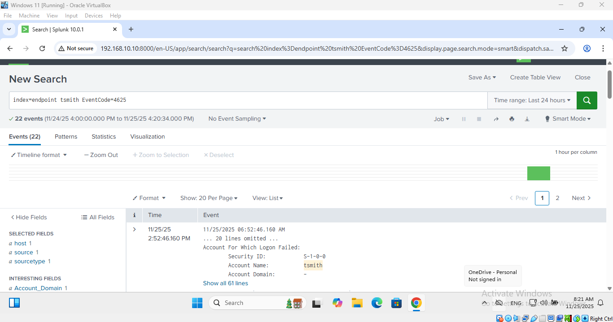  

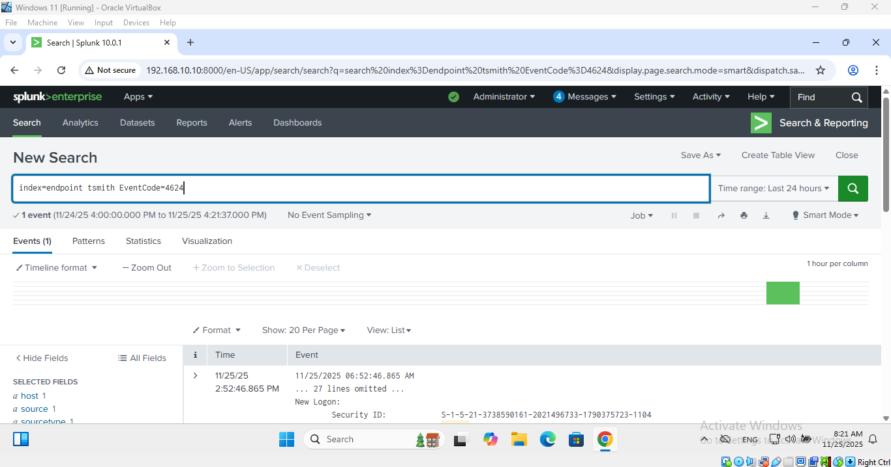  

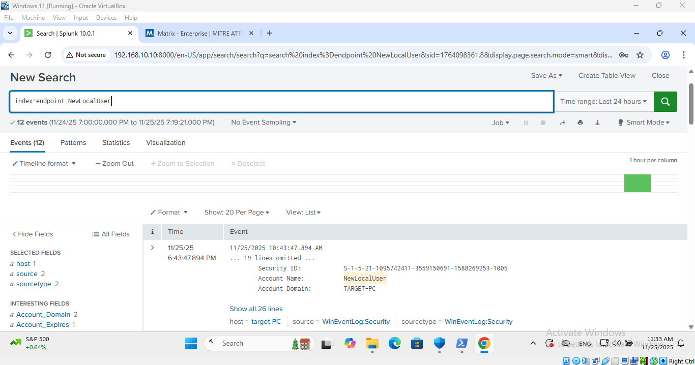  

  


<p align="center"><em>Figure: Splunk showing detections for brute force and ATR tests.</em></p>

## Findings & Analysis

- **Brute force**: Multiple 4625 events from the attacker IP; single 4624 confirms successful authentication after repeated attempts.

- **Persistence**: 4720 entries show ATR-created local accounts.

- **Execution**: Sysmon captured PowerShell process creation with bypass flags — strong indicator of suspicious scripting activity.

- Correlating events across process creation, security events, and host context produced a useful timeline for triage.

## Reflection

In this project, I learned:
- How AD domains operate and how endpoints join a domain
  
- How log forwarding works using Sysmon + Splunk UF

- How to simulate attacks in a controlled environment

- How to analyze Windows Event Logs and Sysmon data

- How brute force patterns appear in real telemetry

- How execution bypass and account creation appear in logs

- How to build a functional SOC-style detection lab

## Skills Demonstrated

- AD installation & domain join

- Sysmon deployment & configuration

- Splunk index & receiving configuration

- Splunk SPL for detection & triage

- Basic attack simulation (Hydra & Atomic Red Team)

- Telemetry correlation and incident analysis

## Tools & Resources

- VirtualBox

- Windows Server 2022 (AD DS)

- Windows 11 endpoint

- Ubuntu Server (Splunk Enterprise)

- Kali Linux (Hydra)

- Splunk Enterprise & Universal Forwarder

- Sysmon (Olafhartong config)

- Atomic Red Team

## License & Disclaimer

This lab was performed in a controlled, isolated environment for learning and defensive research only. The techniques shown are for educational use. Do not use them on unauthorized systems.
